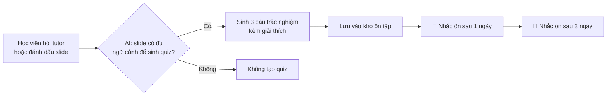

# 📌 VinMark

> **Biến những chỗ chưa hiểu thành quiz ôn tập — đúng lúc, đúng chỗ.**

**Track:** A · Tính năng mới cho VLearn &nbsp;|&nbsp; **Nhóm:** K4-3B-E403

---

## 🎯 Bài toán

### Ai gặp vấn đề?
Học viên đang học lý thuyết trên **VLearn** vừa hỏi **AI tutor** về một đoạn trong slide mà mình chưa hiểu.

### Vấn đề là gì?
Hỏi xong thì học viên **không tìm lại được câu mình đã hỏi** để ôn lại:

- 🔍 Phải lục lại từng đoạn chat gắn với từng slide
- 📸 Hoặc chụp màn hình lưu vào note riêng, rồi không bao giờ mở lại
- 🧪 Đến lúc làm lab vẫn **hổng đúng chỗ cũ**

### Bằng chứng ban đầu

| Khảo sát | Kết quả |
|---|---|
| 12 học viên | **11/12** thấy khó tìm lại những phần kiến thức khó hiểu trên VLearn |

---

## 💡 Giải pháp

VinMark lấy những câu học viên **đã hỏi tutor** hoặc những slide họ **đã đánh dấu**, rồi biến chúng thành quiz ôn tập được nhắc lại theo lịch.

### Phạm vi của bản thử

| | |
|---|---|
| **Khi nào dùng** | Học viên vừa hỏi tutor hoặc vừa đánh dấu một slide |
| **Nhu cầu** | Vài ngày sau cần ôn lại đúng chỗ đó |
| **AI quyết định** | Slide này có **đủ ngữ cảnh** để sinh quiz hay không |
| **Kết quả** | **3 câu trắc nghiệm** kèm giải thích, lưu trong kho ôn tập, nhắc lại sau **1** và **3 ngày** |

### AI làm được đến đâu
AI tổng hợp các câu học viên đã hỏi và các slide đã đánh dấu, **tự tạo quiz** và **nhắc học viên ôn tập**.

---

## 👥 Người dùng thử

Những người dùng ngoài nhóm đã được hỏi và đồng ý dùng thử:

- Nguyễn Ngọc Thái An
- Hồ Hoàng Phương Anh
- Đoàn Anh Quân

---

## 🛠️ Phân công

| Thành viên | Phụ trách |
|---|---|
| **Dũng** | Tìm bằng chứng từ chatlog VLearn (bảng đếm, mã lượt) · soạn bộ câu thử **≥ 20 case** · chạy đo |
| **Huy** | Dựng prototype · gọi AI thật (quyết định slide có đủ ngữ cảnh không, sinh 3 câu quiz kèm giải thích) · nhắc ôn sau 1 và 3 ngày |
| **Khuê** | Canvas · khảo sát **≥ 20 người** · spec (phạm vi, mức tự động, kịch bản rủi ro) · user test · feedback log · changelog · slide và demo |

---

## 📂 Tài liệu

- [canvas.md](canvas.md) — Canvas đề tài
